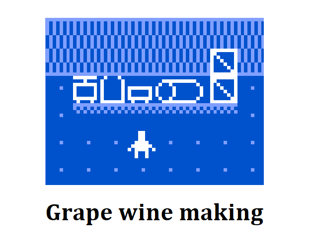

This project created in [itch.io - fermentation (bitsy jam #71)](https://itch.io/jam/bitsy-71-fermentation) for the theme `fermentation`. But late for submission.

## grape wine making game

A [Bitsy](https://make.bitsy.org/) game. Enjoy your time in making grape wine. 

More details can be found in the [online playing page](https://hundun.itch.io/grape-wine-making).

### play locally

The `html` file in `./output`.

Controls guide:

direction keys: move

space: continue the dialogue

### dev

Load bitsy hacks by [bitsy-boilerplate](https://github.com/seleb/bitsy-boilerplate). Use `./dev`.